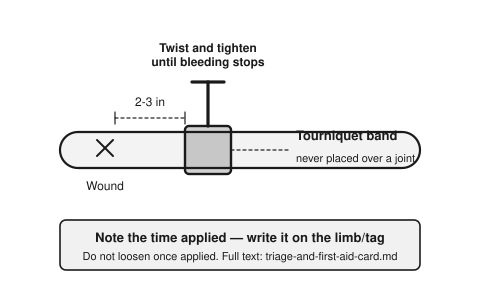

# Triage & First Aid Quick Card

Sources: US Army FM 4-25.11 (First Aid), Hesperian *Where There Is No Doctor*. Not a substitute for training — practice these before you need them.

## 1. Scene safety first
Don't become a second casualty. Check for fire, traffic, structural collapse, electrical, toxic fumes before approaching.

## 2. The ABCs (check in order, fix each before moving on)
1. **Airway** — is it open? Tilt head back, lift chin. Clear visible obstructions.
2. **Breathing** — look/listen/feel for 10 sec. None? Start rescue breaths / CPR.
3. **Circulation** — check pulse. Control severe bleeding *before* anything else if it's spurting or pooling fast.

## 3. Severe bleeding (control before checking anything else)
1. Direct firm pressure with cloth/gauze — don't peek, don't remove soaked cloth, add more on top.
2. Elevate the wound above heart level if possible.
3. If bleeding won't stop and it's a limb: apply a tourniquet 2-3 inches above the wound (not on a joint), tighten until bleeding stops, note the time applied, do not loosen once applied.

4. Pack deep wounds with gauze/clean cloth, then pressure.

## 4. Shock (treat everyone with a serious injury as if in shock)
Signs: pale/cool/clammy skin, rapid weak pulse, confusion, rapid breathing.
- Lay flat, elevate legs ~12in (unless spinal injury or leg fracture suspected).
- Keep warm (blanket under and over).
- Nothing by mouth.
- Get to definitive care fast — shock kills.

## 5. CPR (adult, no training required to start)
1. Confirm unresponsive + not breathing normally.
2. Hands center of chest, push hard/fast 100-120/min, ~2 inches deep.
3. 30 compressions : 2 breaths, repeat.
4. Continue until help arrives, person revives, or you're physically unable.

## 6. Fractures / suspected broken bones
- Don't try to realign. Splint in the position found using rigid material (stick, board) padded and tied above and below the break.
- Check circulation below the injury (color, warmth, pulse) after splinting.

## 7. Burns
- Cool with room-temp water 10-20 min (not ice).
- Do not pop blisters. Cover loosely with clean non-stick cloth.
- Remove rings/tight items near burn before swelling.
- Large/deep burns (bigger than hand, white/charred, or on face/hands/genitals) = seek advanced care urgently, high infection/fluid-loss risk.

## 8. Choking
- Encourage coughing if any air movement.
- No air movement: 5 back blows between shoulder blades, then 5 abdominal thrusts (Heimlich), alternate until cleared or person unconscious → start CPR.

## 9. When to prioritize evacuation over field treatment
Uncontrolled bleeding, airway compromise, chest wounds, signs of internal bleeding (rigid/painful abdomen, coughing blood), altered consciousness, snakebite from a venomous species, severe allergic reaction (anaphylaxis).

See `02-first-aid-medical/` for deep reference material once loaded.
