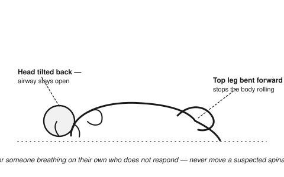

# Medical Emergencies (Non-Trauma)

Recognizing and responding to sudden illness in the field, without diagnostic equipment.

## Heart attack
- **Signs**: chest pain/pressure (may radiate to arm, jaw, back), shortness of breath, sweating, nausea, lightheadedness. Women, older adults, and diabetics may have subtler symptoms (fatigue, indigestion-like discomfort instead of classic chest pain).
- **Response**: have the person rest in a comfortable position (often sitting, leaning slightly forward), loosen tight clothing, keep calm. If aspirin is available and the person has no known bleeding disorder or allergy, chewing one adult (325mg) or four low-dose (81mg) tablets can reduce damage — only if you're reasonably confident it's cardiac and not another cause of chest pain.
- Evacuate urgently; be ready to start CPR if they become unresponsive and stop breathing normally.

## Stroke
- **F.A.S.T. check**: **F**ace drooping on one side, **A**rm weakness/drift on one side, **S**peech slurred or strange, **T**ime — note when symptoms started (critical for any later treatment).
- Other signs: sudden confusion, vision loss, severe headache, loss of balance/coordination.
- Response: keep the person safe and still, note the time of onset, do not give food/water/medication (swallowing may be impaired, aspiration risk), evacuate urgently — time-critical.

## Seizure
- Protect from injury: clear the area of hard/sharp objects, cushion the head, do not restrain the person or put anything in their mouth.
- Time the seizure. Most stop within 1-3 minutes.
- After: roll onto their side (recovery position) once shaking stops, to keep the airway clear as they regain consciousness.

- Seek urgent care if: seizure lasts over 5 minutes, a second seizure follows without regaining consciousness, it's their first seizure ever, injury occurred, or they don't regain normal consciousness within ~20-30 min.

## Anaphylaxis (severe allergic reaction)
- **Signs**: rapid swelling (face/throat/tongue), difficulty breathing/wheezing, widespread hives, rapid pulse, dizziness/fainting, often after a sting, food, or medication.
- **Response**: epinephrine auto-injector if available — administer immediately into the outer thigh, through clothing if needed, this is not optional-if-in-doubt in a true anaphylactic reaction. Call for/move toward advanced care regardless — a second reaction wave can occur after the first dose wears off (~15-20 min). Lay flat with legs elevated unless breathing is easier sitting up; if unconscious/not breathing normally, begin CPR.

## Diabetic emergencies
- **Low blood sugar (hypoglycemia)** — shaking, sweating, confusion, irritability, can progress to unconsciousness: give fast sugar (juice, regular soda, glucose tablets/gel) if conscious and able to swallow. Should improve in 15 min; recheck/repeat if not. Do not give anything by mouth if unconscious — this is now an emergency requiring evacuation.
- **High blood sugar (hyperglycemia/DKA)** — excessive thirst/urination, fruity-smelling breath, confusion, deep rapid breathing: harder to distinguish in the field; if uncertain whether high or low and the person is conscious and can swallow safely, a small amount of sugar generally does far less harm if wrong than withholding it does if they're actually low — but evacuate either way, this needs medical management.

## Choking (see also quick-reference)
- Effective cough = let them keep coughing.
- No air movement: 5 back blows, then 5 abdominal thrusts, alternating, until cleared or the person loses consciousness → begin CPR (compressions can help dislodge an object too — check the mouth briefly between cycles, only remove an object you can actually see).

## Heat illness
- **Heat exhaustion**: heavy sweating, weakness, dizziness, nausea, cool/clammy skin. Move to shade/cool area, remove excess clothing, sip water, cool with wet cloths/fanning.
- **Heat stroke** (emergency): hot/dry or flushed skin, confusion, very high body temperature, possible unconsciousness. Cool aggressively — wet the body and fan, ice packs at neck/armpits/groin if available, evacuate urgently — heat stroke is fatal without rapid cooling.

## Cold illness
- **Hypothermia**: shivering (may stop as it worsens — a bad sign), confusion, slurred speech, clumsiness. Get out of wet/cold conditions, remove wet clothing, warm gradually (dry insulation, warm — not hot — packs at core/torso/armpits/groin, warm sweet drinks if conscious and alert), avoid rough handling (risk of cardiac arrhythmia in severe cases). Do not rewarm extremities before the core if severe — can cause dangerous blood pressure shifts.
- **Frostbite**: numbness, white/grey/waxy skin. Rewarm gradually in warm (not hot) water once away from refreeze risk — refreezing thawed tissue causes far worse damage than staying frozen until you reach definitive shelter. Do not rub the area.

## Poisoning / ingestion
- Identify what was ingested if possible (keep the container/plant sample).
- Do not induce vomiting unless specifically directed by a poison control resource for that substance — some substances (petroleum products, caustics) cause more damage coming back up.
- Conscious and alert: rinse the mouth, small sips of water if advised for the specific substance.
- Unconscious or difficulty breathing: recovery position, monitor airway, evacuate urgently.

## Dehydration
- Signs: thirst, dark urine, dry mouth, fatigue, dizziness, in severe cases confusion/rapid heartbeat.
- Oral rehydration: clean water plus a pinch of salt and a bit of sugar per liter improves absorption (basic oral rehydration solution) — especially important with diarrhea/vomiting losses.
