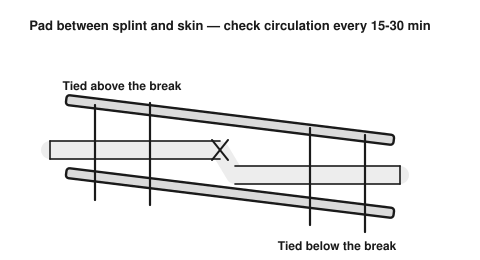
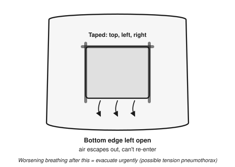

# Trauma & Wound Care

Broad, source-crosschecked field reference (US Army FM 4-25.11, Hesperian *Where There Is No Doctor*). Deeper than the `01-quick-reference/triage-and-first-aid-card.md` summary — read that first for the immediate ABCs.

## Wound cleaning
1. Wash your hands / wear gloves if available — infection is the biggest secondary threat.
2. Stop active bleeding first (pressure, elevation, tourniquet if severe — see quick-reference card).
3. Once bleeding is controlled, irrigate the wound with clean/treated water — flush out debris, don't scrub deep wounds.
4. Remove visible debris with clean tweezers if easily accessible; don't dig for deeply embedded objects — extraction risk can exceed infection risk, get to advanced care instead.
5. Cover with clean, non-stick dressing. Change dressing daily or when wet/dirty.
6. Watch for infection: increasing redness/warmth/swelling, pus, red streaking from the wound, fever — these need antibiotics if available and urgent evacuation if not improving.

## Impaled objects
Do **not** remove an object impaled in the body (deep puncture, embedded knife/rebar/etc.) — it may be blocking further bleeding. Stabilize it in place with bulky padding around it, immobilize the area, evacuate for surgical removal.

## Fractures — deeper reference

- **Closed fracture**: skin intact. Splint in the position found, padded, immobilizing the joint above and below the break.
- **Open fracture**: bone breaks skin — higher infection risk. Control bleeding, cover the wound (don't push bone back in), splint without pressing on the exposed bone, evacuate urgently — open fractures need surgical cleaning.
- **Suspected spinal injury** (fall from height, diving injury, high-speed impact, neck/back pain, numbness/tingling in limbs): minimize movement, support head/neck in the position found, do not attempt to realign, wait for trained help if at all possible.
- Check circulation, sensation, and movement below any fracture/splint every 15-30 min — a too-tight splint can cut off blood flow.

## Dislocations
- Signs: visibly deformed joint, severe pain, inability to move it.
- Do not attempt to "pop it back in" without training — you can worsen nerve/vessel damage. Splint/support in the position found and evacuate.
- Exception: a trained provider may reduce certain simple dislocations (e.g. finger) if evacuation is many hours/days away — this requires specific technique training, not general first aid knowledge.

## Sprains/strains (soft tissue injury)
**R.I.C.E.**: Rest, Ice (or cold water, 20 min on/off), Compression (elastic wrap, not so tight it cuts circulation), Elevation above heart level. Reassess after 48-72 hrs; worsening pain, inability to bear weight, or visible deformity suggests fracture instead — treat as fracture if unsure.

## Head injury
- Any loss of consciousness, confusion, repeated vomiting, worsening headache, unequal pupils, or seizure after a head hit = evacuate for advanced care urgently — risk of internal bleeding/swelling.
- Mild head injury without those signs: rest, monitor closely for 24-48 hrs, wake periodically to check responsiveness if sleeping.

## Chest injury

- **Open chest wound** (sucking chest wound): cover with an airtight material (plastic wrap, dressing packaging) taped on 3 sides only — this lets air escape but not re-enter, preventing lung collapse from worsening. Watch for worsening breathing difficulty (possible tension pneumothorax — evacuate urgently, this can be fatal without a professional needle decompression).
- **Suspected rib fracture**: pain with breathing/movement, tenderness over ribs. Don't wrap the chest tightly (restricts breathing) — pain management and gentle activity as tolerated, watch for breathing difficulty.

## Abdominal injury
- Closed injury with rigid/painful abdomen, bruising, blood in urine/stool = possible internal bleeding — evacuate urgently, nothing by mouth, monitor for shock.
- Open wound with organs protruding: do not push organs back in. Cover with a clean, moist (if possible) dressing, loosely, and evacuate urgently.

## Eye injury
- Chemical splash: flush continuously with clean water for 15-20 min, eyelid held open, before anything else.
- Embedded object: do not remove or press on the eye. Cover both eyes loosely (to minimize movement) and evacuate.
- Blunt trauma: cold compress, watch for vision changes/increasing pain — evacuate if vision affected.

## Animal/insect bites and stings
- Clean any bite wound thoroughly — animal mouths carry heavy bacterial load, infection risk is high.
- Venomous snakebite: keep the person calm and still (movement spreads venom faster), remove rings/tight items near the bite before swelling, keep the bite roughly at heart level, do not cut the wound or attempt to suck out venom (folk remedy, doesn't work, delays real treatment), evacuate urgently — antivenom is the only definitive treatment. Note distinguishing features of the animal if safely possible (for identification) but don't risk further bites doing so.
- See `06-animals-insects/` for region-specific dangerous species identification.

## When to prioritize evacuation (expanded from quick-reference)
Any of: uncontrolled bleeding, airway/breathing compromise, chest/abdominal penetrating wounds, signs of internal bleeding, altered consciousness/head injury with warning signs, suspected spinal injury, open fractures, severe burns, venomous bite/sting, anaphylaxis, worsening infection.
