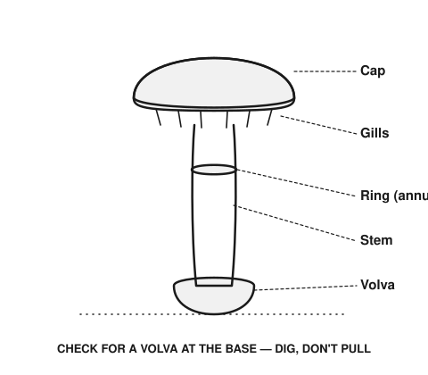

# Fungi (Mushroom) Foraging Safety

Read this before any other fungi content in this archive. Mushroom identification is a genuinely different risk category from plant identification, and this file is deliberately more restrictive than the rest of `05-plants-fungi/`.

## Why fungi are treated differently here
- Several of the deadliest plant/fungus poisonings in the world come from mushrooms that closely resemble common edible species — the amatoxins in *Amanita phalloides* ("death cap") and related *Amanita* species cause fatal liver failure, often after a symptom-free delay of 6-24+ hours that can create a false sense of safety before the real damage is already underway.
- Reliable identification of many mushroom species requires features not practical to describe safely in a general reference: spore print color, precise gill attachment, microscopic features, and subtle differences from toxic look-alikes that vary by region and even by individual specimen age.
- Unlike most plants, there is no reliable universal "safety test" for mushrooms — the folk methods sometimes repeated (silver spoon discoloration, testing on animals, cooking removes all toxins) are **false** and have caused fatalities. Do not use any of these.

## What this archive will and won't do
- This archive will **not** attempt to provide species-level mushroom identification guides — doing so from a general reference risks false confidence in exactly the situation where that confidence kills.
- What's provided instead: safety principles, and named examples of highly dangerous, widely-distributed genera to know to avoid entirely without expert training.

*Vocabulary reference only, not a species guide.* The volva (a cup-like sac at the base) is one of the most commonly missed features because it's often underground — always dig up the full base rather than pulling, and check for one before considering any wild mushroom further.

## Core safety rules
1. **Never eat a wild mushroom you cannot identify with certainty from multiple independent, expert-level features** — a photo match alone is not enough; regional look-alikes are common and often subtly different.
2. **Learn from a real person, not a book or app alone.** Local foraging groups, mycological societies, and experienced foragers who can show you a specimen in hand are the actual reliable path to safe mushroom identification — this is one of the few domains where hands-on, local, expert instruction is genuinely necessary rather than a nice-to-have.
3. **Cooking does not reliably neutralize the most dangerous toxins** (notably amatoxins) — don't rely on cooking as a safety step for an uncertain specimen.
4. **When in doubt, don't** — there is no partial-credit outcome with the deadliest species; a "probably fine" mushroom is not worth the downside.
5. If a wild mushroom is eaten and any illness follows (even mild, even many hours later), **treat it as a medical emergency and seek care immediately**, and if possible bring a sample or clear photo of the mushroom eaten — amatoxin poisoning is treatable if caught early enough, and time matters enormously.

## Genera worth knowing to avoid by default (not an identification guide — a name-recognition list)
- ***Amanita*** — includes the death cap and destroying angel groups, responsible for the large majority of fatal mushroom poisonings worldwide; also includes some edible species, which is exactly the danger — avoid the entire genus without expert-level training.
- ***Galerina*** — small brown mushrooms that can resemble edible species and also contain amatoxins.
- ***Conocybe*** and other small brown "LBM" (little brown mushroom) groups generally — highly difficult to distinguish from toxic species reliably; a widely-used rule among foragers is to avoid small brown mushrooms as a category unless you have specific expert training in that group.

## If mushroom cultivation (not foraging) is the goal
Growing known, purchased/verified spawn of a specific edible species (oyster mushrooms, shiitake, etc.) in a controlled setting avoids the identification risk entirely, since you control the starting material. This is a very different and much safer activity than wild foraging, and worth prioritizing over foraging if mushrooms are wanted as a reliable food source — see `04-food-agriculture/` for cultivation-oriented content as it's built out.
