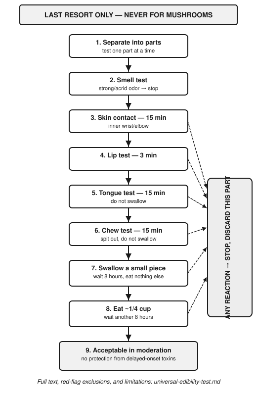

# Universal Edibility Test

A last-resort protocol (drawn from US Army survival doctrine, e.g. FM 21-76) for evaluating a plant when you cannot positively identify it and have no reference material to confirm safety. **This is not a substitute for identification** — it exists for genuine last-resort situations, takes many hours to do properly, and still cannot detect every toxin (some act on a delay of many hours to days, and the test does not protect against those). Positive identification against `05-plants-fungi/` reference material or a trained forager is always preferable.

## Before you start
- Only test one plant at a time.
- Only test plants that are abundant nearby — no point risking discomfort/illness for a plant you can't gather more of.
- Never test fungi with this method — see `fungi-foraging-safety.md`. Fungal toxins are not reliably screened by this protocol and the consequences are disproportionately severe.
- Skip any plant with these automatic red flags (do not test them at all): milky or discolored sap, spines/fine hairs, umbrella-shaped flower clusters (many toxic plants in the carrot/parsley family share this shape with edible ones — see `toxic-plants-widely-confused.md`), a bitter or soapy taste in the initial contact test below, beans/bulbs/seeds inside pods (many are toxic), an almond scent in woody parts/seeds (possible cyanide compounds), grain heads with pink/purple/black spurs (possible fungal contamination like ergot).

## The test — each step is a separate several-hour stage
1. **Separate the plant into parts** (roots, stems, leaves, buds, flowers) — test only one part at a time, since edibility can differ between parts of the same plant.
2. **Smell test**: crush a portion, smell for strong/acrid odors — a strongly disagreeable smell is a reason to stop with that part.
3. **Skin contact test**: place a piece on the inner wrist or elbow for 15 minutes. Reaction (burning, itching, rash) = do not proceed with that part.
4. **Lip test**: touch a small piece to your lips for 3 minutes, watching for burning/itching/numbness. Any reaction = stop.
5. **Tongue test**: place a small piece on your tongue, hold for 15 minutes without swallowing. Any burning, numbness, or strong unpleasant reaction = stop.
6. **Chew test**: chew a small piece for 15 minutes without swallowing, watching for the same reactions. Spit out.
7. **Swallow test**: if no reaction through the above, swallow a small piece and wait **8 hours** without eating anything else, watching for nausea, cramping, or other symptoms.
8. **Small quantity test**: if no reaction after 8 hours, eat a slightly larger quantity (about a quarter cup) prepared the same way and wait another **8 hours**.
9. Only after both waiting periods produce no reaction should the plant part be considered acceptable to eat in normal quantities — and even then, in moderation, since this test cannot rule out cumulative or delayed effects.

## Important limitations
- This process takes at minimum ~24 hours per plant part and provides no protection against delayed-onset toxins (some serious plant toxins don't produce symptoms for a day or more).
- It provides no protection at all against fungal toxins — never apply it to mushrooms.
- A plant passing this test is not necessarily nutritionally worthwhile — palatability and food value are separate questions from safety.
- This exists as a last-resort tool for genuine survival situations with no other option, not as a general foraging method — always prefer positive identification first.
